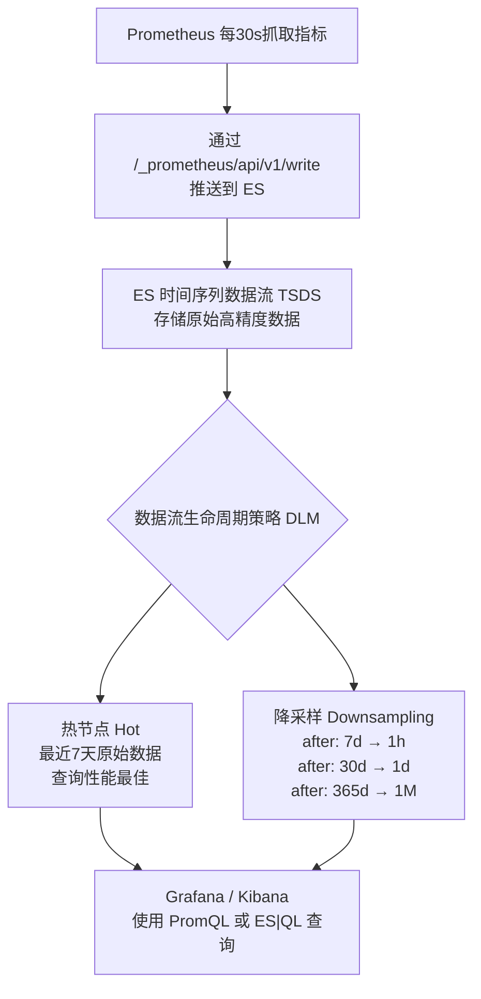

## 📊 方案总体架构与数据流



---

## 🚀 搭建与配置步骤（按顺序执行）

### 第一步：搭建 Elasticsearch

确保 Elasticsearch 版本 **≥ 9.x**（推荐 9.4），以支持 TSDS 和 DLM 降采样功能。

### 第二步：创建自定义索引模板（核心）

在 Kibana Dev Tools 中执行以下命令，创建自定义模板。**关键作用是覆盖内置模板，确保 DLM 优先于 ILM。**

```json
PUT _index_template/your-prometheus-template
{
  "index_patterns": ["metrics-*.prometheus-*"],
  "data_stream": { },
  "priority": 500,
  "template": {
    "settings": {
      "index.lifecycle.prefer_ilm": false
    },
    "lifecycle": {
	  "downsampling": [            // 最近7天内保持原始粒度（30s），无需额外配置
		{
		  "after": "7d",           // 数据写入7天后，执行第一轮降采样
		  "fixed_interval": "1h"   // 降采样为1小时粒度，满足“最近一个月看小时趋势”
		},
		{
		  "after": "30d",          // 数据写入30天后，执行第二轮降采样
		  "fixed_interval": "1d"   // 进一步降采样为1天粒度，满足“最近一年看天趋势”
		},
		{
		  "after": "365d",         // 数据写入365天（1年）后，执行第三轮降采样
		  "fixed_interval": "1M"   // 降采样为1月粒度，满足“一年前看月度趋势”
		}
	  ]
    }
  }
}
```

> **配置说明**：
> - `index_patterns`：必须与 Remote Write URL 中的路径匹配（见第四步）。
> - `priority: 500`：高于内置模板优先级，确保覆盖。
> - `index.lifecycle.prefer_ilm: false`：**最关键**，强制使用 DLM。
> - `downsampling`：定义三级降采样策略（7天→1小时，30天→1天，1年→1月）。

### 第三步：为已存在的数据流手动配置 DLM（可选）

如果是全新的环境，可跳过此步。如果已有存量数据流，需要单独为其配置 DLM：

```json
PUT _data_stream/metrics-infrastructure.prometheus-production/_lifecycle
{
  "downsampling": [
    { "after": "7d", "fixed_interval": "1h" },
    { "after": "30d", "fixed_interval": "1d" },
    { "after": "365d", "fixed_interval": "1M" }
  ]
}
```

### 第四步：搭建并配置 Prometheus

在 `prometheus.yml` 中配置 Remote Write，指向 Elasticsearch 的 `/_prometheus/api/v1/write` 端点：

示例1：
```yaml
global:
  scrape_interval: 15s

scrape_configs:
  - job_name: "prometheus"
    static_configs:
      - targets: ["localhost:9090"]

  - job_name: "node_lite"
    scrape_interval: 15s
    static_configs:
      - targets: ["host.docker.internal:9100"]

remote_write:
  - url: "http://<ES_HOST>:9200/_prometheus/metrics/npu/default/api/v1/write"
    write_relabel_configs:
      - source_labels: [__name__]
        regex: "node_lite_.*|npu_.*"
        action: keep
  - url: "http://<ES_HOST>:9200/_prometheus/metrics/gpu/default/api/v1/write"
    write_relabel_configs:
      - source_labels: [__name__]
        regex: "gpu_.*"
        action: keep
```

示例2：
```yaml
remote_write:
  - url: "http://<ES_HOST>:9200/_prometheus/metrics/infrastructure/production/api/v1/write"
```

`/_prometheus/api/v1/write` 端点支持**三种层级**的路径配置，每个层级都对应着不同的数据流名称规则。

| 路径层级 | 端点 (Endpoint) | 目标数据流 (Data Stream) |
| :--- | :--- | :--- |
| **0层 (默认)** | `/_prometheus/api/v1/write` | `metrics-generic.prometheus-default` |
| **1层 (仅数据集)** | `/_prometheus/metrics/{dataset}/api/v1/write` | `metrics-{dataset}.prometheus-default` |
| **2层 (数据集+命名空间)** | `/_prometheus/metrics/{dataset}/{namespace}/api/v1/write` | `metrics-{dataset}.prometheus-{namespace}` |

**核心规则如下：**

*   **URL路径与数据流名称的对应关系**：数据流名称的格式固定为 `metrics-{dataset}.prometheus-{namespace}`。其中，`{dataset}` 和 `{namespace}` 的值直接从URL路径中对应的位置获取。
*   **默认值**：如果路径中没有提供 `{dataset}`，则默认为 `generic`；如果没有提供 `{namespace}`，则默认为 `default`。
*   **名称清洗（Sanitization）**：无论是从URL路径还是从标签中获取的 `dataset` 和 `namespace` 值，Elasticsearch都会进行清洗。任何**非字母、数字、连字符（`-`）或下划线（`_`）的字符都会被替换为下划线 `_`**。例如，`my-dataset!` 会被清洗为 `my-dataset_`。

> **注意**：URL 路径中的 `metrics/npu/default` 决定了数据流名称为 `metrics-npu.prometheus-default`，必须与模板的 `index_patterns` 一致。

### 第五步：验证配置是否生效

启动 Prometheus 开始写入数据后，执行以下 API 验证：

```json
// 查看数据流状态，确认 next_generation_managed_by 为 "Data stream lifecycle"
GET _data_stream/metrics-infrastructure.prometheus-production

// 查看当前生效的 DLM 策略
GET _data_stream/metrics-infrastructure.prometheus-production/_lifecycle
```

---

## 💡 关键设计决策说明

| 配置项 | 决策 | 理由 |
| :--- | :--- | :--- |
| **`data_retention`** | **不配置** | 数据永久保留，仅通过降采样降低精度，不删除任何数据 |
| **降采样策略** | 7d→1h，30d→1d，365d→1M | 平衡存储成本与查询需求，满足“近期精确、历史看趋势” |
| **`prefer_ilm: false`** | **必须配置** | 确保新数据由 DLM 管理，而非 ILM |
| **索引模板优先级** | `priority: 500` | 覆盖 Elasticsearch 内置模板（默认优先级较低） |
| **Remote Write URL** | 包含 `metrics/infrastructure/production` | 通过路径控制数据流名称，与模板精确匹配 |

---

## ⚠️ 重要前提与注意事项

1. **版本要求**：Elasticsearch **≥ 9.x**（推荐9.4.0）。
2. **降采样的触发时机**：`after` 时间从数据写入后开始计算，达到指定时间后才会触发降采样，并非实时执行。
3. **降采样后的数据**：原始高精度数据会被删除，替换为聚合后的摘要文档（包含 min/max/sum/value_count），查询时对用户透明。
4. **修改降采样策略**：直接修改模板仅影响未来新建的数据流；如需对已有数据流生效，需额外调用 `PUT _data_stream/<名称>/_lifecycle` API。

---

## 📈 最终效果

| 时间范围 | 数据粒度 | 查询用途 |
| :--- | :--- | :--- |
| 最近 7 天 | 原始精度（30s） | 实时监控、故障排查 |
| 7 天 ~ 30 天 | 1 小时 | 日趋势分析 |
| 30 天 ~ 1 年 | 1 天 | 月度趋势、容量规划 |
| 1 年以前 | 1 月 | 长期趋势、年度报告 |

所有数据永久保留，存储成本通过多级降采样控制，查询性能随数据老化而保持稳定。

