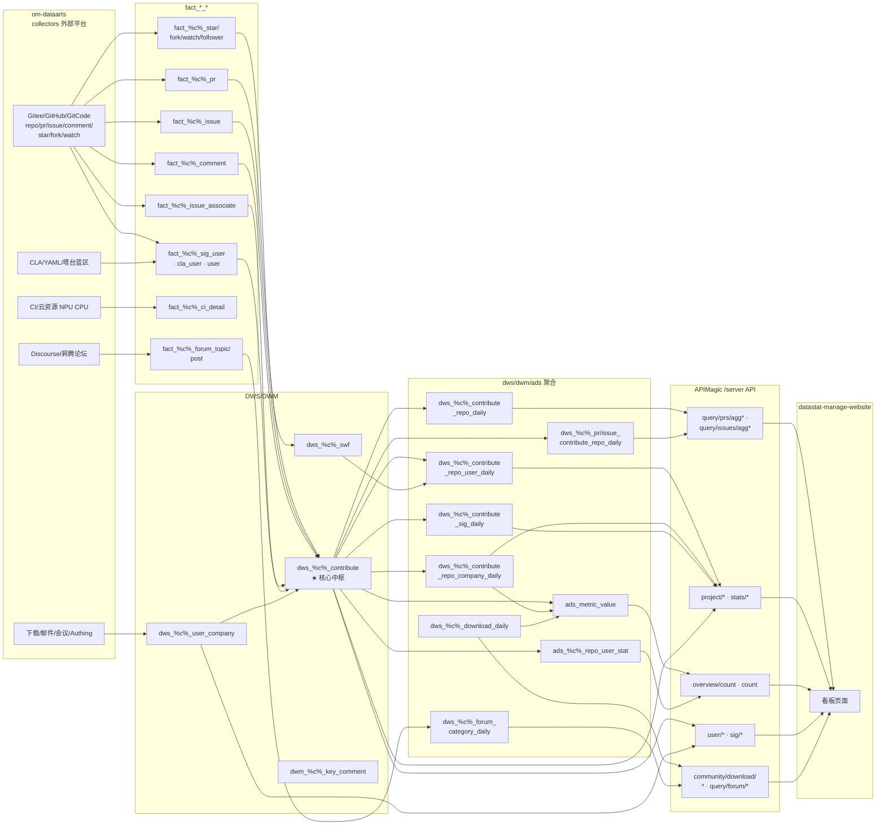
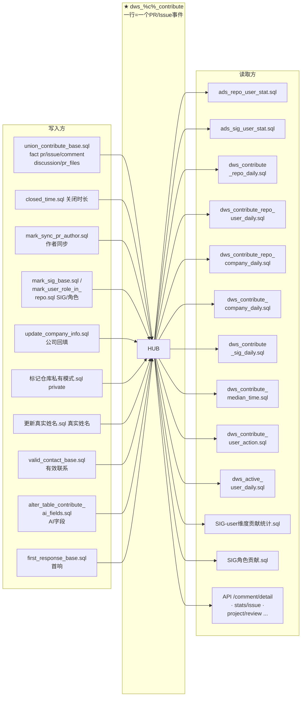
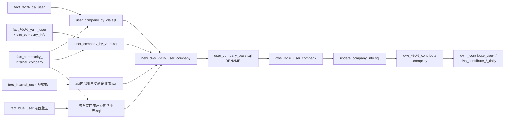
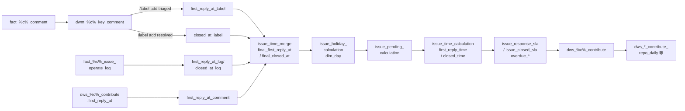
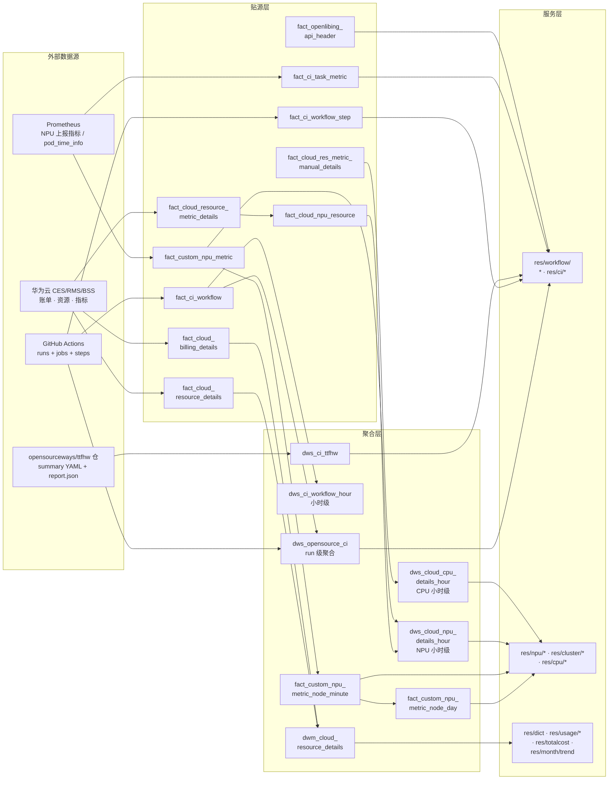

# 数据血缘分析（Data Lineage）

> 基于对 om-dataarts、APIMagic、datastat-manage-website 三服务源码的只读分析。
> 血缘来源：om-dataarts `om/pipelines/sql/*.sql`（128 个）+ `.job` 流水线 + `om/tasks/code/*generate*.py` + `om/collector/*`（CI/Prometheus/云资源）；APIMagic `magic-api/api/**/*.ms`（356 个 API）；datastat-manage-website `src/api/*.ts`。
> 约定：`{c}` = `{community}` 参数化占位（`fact_{community}_*`）。`swap` = 临时表全量换表（`*_temp` → RENAME）。
> Mermaid 图中占位符写作 `%c%`（`{c}` 的 `{}` 与 `<>` 在 mermaid 中分别会破坏语法/被当作 HTML 标签吞掉）。
> 完整子代理分析报告归档于 [docs/lineage/](lineage/README.md)：om-dataarts 128 SQL 逐文件血缘（`lineage/om-dataarts/sql_lineage.md`）与 APIMagic 356 API→表映射（`lineage/apimagic/final_report.md` / `map.txt`）。

---

## 1. CI / Workflow 总览

三个仓库各含 5 个 GitHub Actions workflow + 2 个脚本，基本同构，用于 PR 门禁与镜像扫描：

| Workflow 文件 | 触发 | 作用 |
|---|---|---|
| `gate-check.yml` | PR(opened/synchronize/reopened) → main/master/release/* | 删除 `gate_check_pass` 标签 → 调 CodeArts Pipeline 跑门禁 → PR 评论"开始门禁检查" |
| `label-check.yml` | PR(label/unlabel/opened/reopened/edited) | 校验 PR 必须带 `gate_check_pass` 标签 |
| `check-label-owner.yml` | PR(labeled) | 校验 `gate_check_pass` 只允许 `opensourceways-robot` bot 打（否则删除） |
| `pr-branch-check.yml` | PR(opened/synchronize/reopened) | 分支命名规范：→default 必须 `release/*`；→`release/*` 必须 `feature/*`/`bugfix/*` |
| `scan-image.yml` | issue_comment(created) | 评论以「扫描镜像：」开头时调 CodeArts 镜像扫描流水线 |

**差异点：**
- `datastat-manage-website/.github/workflows/gate-check.yml`：多了 `feature`、`staging` 分支触发。
- `datastat-manage-website/.github/workflows/label-check.yml`：内容实际是**分支命名检查**（与 om-dataarts 的 label-check 不同，文件名与内容错位）。
- 脚本 `codearts_check.sh`、`scan_image.sh` 三仓完全一致。

**数据流水线（真正的"workflow"）**在 om-dataarts `om/pipelines/scripts/生产环境/*.job`（DolphinScheduler 导出 JSON），含 `common/`（dws_contribute_base、fact_data_collector、download、whitebox…）、`release_pipeline/pipeline_<community>.job`（每社区一条）、`module/` 等约 130 个 job；节点用 `sql_runner_executor` 执行 `om/pipelines/sql/*.sql`。

---

## 2. 关系表（表与表之间的"关系/桥"）

| 关系表 | 桥接的两侧 | 关键字段 |
|---|---|---|
| `fact_{c}_issue_associate` | `fact_{c}_issue` ↔ `fact_{c}_pr`（Issue 由哪些 PR 闭环） | `issue_id` + `associate_url`(≈pr.html_url) |
| `fact_{c}_comment` | `fact_{c}_pr`/`fact_{c}_issue` ↔ 评论（**PR/Issue 评论同表**） | `ref_id` + `comment_type`(pr_comment/issue_comment) |
| `dwm_{c}_key_comment` | `fact_{c}_comment` → clean 规则 → `fact_{c}_issue`（首响/关闭信号） | body `/label add triaged/resolved/pending` |
| `dwm_{c}_comment` | `fact_{c}_comment` → `dws_{c}_contribute`（首响明细） | `ref_id`/`ref_uuid` |
| `fact_{c}_issue_operate_log` | Issue 处理时间线（gitcode 全量 / github label） | `issue_id` + `action_type` |
| `fact_community_structure` | 子社区 ↔ 超级社区聚合（mindall/mindlead/mindjoin） | `parent_name` + `status='active'` |
| `fact_{c}_user_mapping` | 平台账号 ↔ oneid 归并/邮箱 | `user_login` |
| `fact_community_robot_user` | bot 账号 ↔ 各统计表（排 bot 用） | `user_login` |
| `fact_community_internal_company` | 公司 ↔ 内/外部判定（内部=华为） | `company` |
| `dim_domain_company` | 邮箱域名 ↔ 公司映射 | `domain` + `company` |
| `dws_{c}_user_company` | 用户 ↔ 公司归属（贡献表 company 回填源） | `user_login` + `company` |
| `dim_day` | 日期 ↔ 节假日/工作日（工时换算） | `uuid`=date |
| `fact_{c}_sig_user` | SIG ↔ 用户 | `sig_name` + `user_login` |
| `fact_{c}_issue_associate` / `dim_{c}_sig` | PR/Issue ↔ SIG 归属 | `tag_sig_name`/`sig_name` |

---

## 3. 全表来源（生产者）与消费者

### 3.1 贴源层 fact（来源=om-dataarts collector；消费者=pipeline SQL）

| 表 | 来源（collector/外部） | 消费者（读它的 SQL/API） |
|---|---|---|
| `fact_{c}_repo` | `repo.py RepoCollector`（Gitee/GitHub/GitCode） | `union_contribute_base`、`ads_repo`、`标记仓库私有模式`、`有效维护目录`、`/repo/*`、`/project/repolist`、`/query/*` |
| `fact_{c}_pr` | `pr.py PrCollector` | `union_contribute_base`、`mark_sync_pr_author`、`dwm_contribute_user*`、`dws_active_*_daily`、`/query/user/pr/detail` |
| `fact_{c}_issue` | `issue.py IssueCollector` | `union_contribute_base`、`alter_table_contribute_is_resolved`、`/query/issues/detail`、`/stats/cve`、`/project/hotspot` |
| `fact_{c}_comment` | `pr_comment.py` / `issue_comment.py` | `union_contribute_base` → `dwm_*_comment/key_comment` |
| `fact_{c}_discussion` | discussion collector | `union_contribute_base`（条件含） |
| `fact_{c}_pr_files` | pr_files collector | `union_contribute_base`（AI PR 聚合） |
| `fact_{c}_issue_associate` | `issue_ref_pr.py` | `mark_version`、`/query/issue/ref/pr` |
| `fact_{c}_star/_fork/_watch/_follower` | `star.py/fork.py/watch.py/follower.py` | `union_swf` → `dws_{c}_swf` |
| `fact_{c}_user` | `user.py UserCollector` | `/query/users*`、`/project/summary`、`sigtopn/user` |
| `fact_{c}_sig_user` | sig_user collector | `mark_sig_base`、`mark_user_role_in_repo`、`SIG角色贡献`、`有效维护目录`、`/sig/*`、`/stattc/sigs` |
| `fact_{c}_cla_user/_cla_company` | `同步CLA数据.sql` / CLA collector | `user_company_by_cla`、`ads_checkout_datastat__company`、`/organization/claCount`、`usercla/list` |
| `fact_{c}_yaml_user` | `yaml_user数据同步.sql` | `user_company_by_yaml`、`gitcode同步yaml用户数据` |
| `fact_email_login` | `gitcode同步gitee邮箱.sql` / `pr_commit_to_email` | `user_company_by_cla` |
| `fact_{c}_forum_topic/_post/_category/_tag/_user/_user_visit/_search_logs/_review_logs` | `discuss_forum_collector.py` / `discourse_db_collector.py` | `community_forum_category[_tag]_generate`、`forum_*` 清洗、`/query/forum/*`、`/stats/forum` |
| `fact_{c}_ci_detail` | ci collector | `中间表-聚合社区CI数据.sql` → `dwm_{c}_ci_info` |
| `fact_{c}_meeting_info/_participants` | meeting collector（含 ES 导入） | `dwm_meeting.sql` → `dwm_{c}_meeting`、`/meeting/*` |
| `fact_{c}_email_list/_member/_email` | email collector | `dwm_email.sql`、`dwm_contribute_user_*_unifiedbus` |
| `fact_{c}_authing_user` | authing collector | `Authing账号企业信息.sql`、`/query/regist/user/detail` |
| `fact_{c}_tracker_search` | tracker collector | `/stats/itegration` |
| `fact_{c}_repo_search` | search collector | `/stats/itegration` |
| `fact_{c}_download` / `fact_*_download`(docker_hub/pypi/gitee/obs/oepkgs/model/cn) | download collectors | `dws_common_download.sql` → `dws_*_download_daily` |
| `fact_ci_workflow` / `fact_custom_npu_metric` / `fact_cloud_npu_resource` | CI/云资源 collector | `dws_npu.sql` → `dws_cloud_npu_details_hour`、`/res/*` |
| `fact_blue_user` | 塔台蓝区采集 | `塔台蓝区用户更新企业表.sql`、`白盒` 相关 |
| `fact_ttfhw_issue` | **API 写**：`/ttfhw/submit`、`/ttfhw/confirm` | `/ttfhw/issues/list/options/overview` |

### 3.2 中间/汇总层（来源=pipeline SQL；消费者=pipeline SQL / APIMagic API）

| 表 | 来源（生产者） | 消费者 |
|---|---|---|
| **`dws_{c}_contribute`**（核心中枢） | `union_contribute_base.sql`（UNION fact pr/issue/comment/discussion）+ 12+ 个 UPDATE 回填（closed_time、mark_sig、company、private、真实姓名、AI 字段…） | **~28 个 SQL**：ads_repo_user_stat、ads_sig_user_stat、dwm_contribute_*、dws_contribute_*_daily、dws_active_*_daily、SIG-user 维度贡献统计、SIG角色贡献、dws_checkout；**~20 个 API**：`/comment/detail`、`/user/level/detail`、`/health/{c}/companies`、`/query/issues/detail`、`/stats/issue`、`/project/review`、AI 统计、sig/pr/count 等 |
| `dws_{c}_swf` | `union_swf.sql`（star/watch/fork/follower + old_openeuler_gitee_swf） | `dwm_contribute_*`、`dws_active_*_daily`、`user/level/detail`、`/query/repo/user/detail/v2` |
| `dws_{c}_prissue_comment` | `dws_prissue_contact.sql` | `mark_version.sql`、`valid_contact_base.sql`、AI 统计 `/ai-metrics/*`、`/sig/pr/exteral/ratio` |
| `dws_{c}_contribute_repo_daily` | `dws_contribute_repo_daily.sql`（swap） | `/project/response-time`、`/project/trend/pr`、`/project/review_pr_total`、`/query/filter`、`sig/totalCount` |
| `dws_{c}_contribute_repo_user_daily` | `dws_contribute_repo_user_daily.sql`（swap）+ 超级社区聚合 | `/project/active`、`/project/summary`、`/project/topn/*`、`/query/repo/user/*`、`/stats/contribute`、`/stats/user_retention` |
| `dws_{c}_contribute_repo_company_daily` | `dws_contribute_repo_company_daily.sql` | `ads_sum.sql`、`/company/contribute`、`/project/leverage-ratio`、`/project/topn/company/pr` |
| `dws_{c}_contribute_company_daily` | `dws_contribute_company_daily.sql` | `/stats/company`、`/query/company/detail`、`/query/filter` |
| `dws_{c}_contribute_sig_daily` | `dws_contribute_sig_daily.sql` | AI 统计、`/query/sig/leverage-ratio`、`/query/filter` |
| `dws_{c}_pr/issue_contribute_repo_daily` | `community_pr/issue_contribute_generate.py`（swap） | `/query/prs/agg*`、`/query/issues/agg*` |
| `dws_{c}_pr/issue_contribute_sig_daily` | `community_sig_pr_issue_generate.py` | `/query/prs/agg/sig`、`/query/issues/agg/sig` |
| `dws_{c}_contribute_user_daily` | `dws_contribute_user_daily.sql`（D0/D1/D2 分层） | （看板漏斗） |
| `dws_{c}_contribute_user_detail_daily` | `dws_contribute_user_detail_daily.sql` | `/report/{platform}/month/contribute` |
| `dws_{c}_contribute_median_time` | `dws_contribute_median_time.sql` | 看板响应中位时长 |
| `dws_{c}_contribute_user_action` | `dws_contribute_user_action.sql` | 活跃 review 统计 |
| `dwm_{c}_contribute_user` | `dwm_contribute_user.sql`（dws_contribute ∪ swf） | `/userlist`、`user/info`、`/user/totalCount`、`/user/trend/user`、`/query/filter` |
| `dwm_{c}_contribute_user_repo` | `dwm_contribute_user_repo.sql` | `/query/repo/user/*`、`/user/level/detail`、`/user/ratio/*` |
| `dwm_{c}_contribute_user_company` | `dwm_contribute_user_company.sql` | `/query/contributes/*`、`/customization/role/contribute` |
| `dwm_{c}_contribute_user_sig` | `dwm_contribute_user_sig.sql` | `/query/users*` |
| `dwm_{c}_company` | `dwm_contribute_comapny.sql` | `organization/totalCount`、`/query/contributes/*` |
| `dwm_{c}_contribute_active_user_{period}` | `dwm_contribute_active_user.sql` | 活跃用户看板 |
| `dws_{c}_active_user_daily` / `_active_repo_user_daily` | `dws_active_*_daily.sql`（中间表） | `/user/active/user` |
| `dws_{c}_user_company` | `new_dws_{c}_user_company` RENAME（`user_company_base.sql`）+ 蓝区/修复 SQL | `update_company_info.sql`、`dwm_contribute_user*`、`/user/companies`、`user/level/detail` |
| `new_dws_{c}_user_company` | `user_company_by_cla.sql` / `_by_yaml.sql` / 内部用户 / 塔台蓝区 | `user_company_base.sql`（RENAME 提升） |
| `dwm_{c}_ci_info` | `中间表-聚合社区CI数据.sql`（源 fact_ci_detail） | `/project/ci/build/info`、`/project/ci/metric` |
| `dwm_{c}_meeting` | `dwm_meeting.sql` | 会议看板 |
| `dwm_{c}_email` | `dwm_email.sql` | 邮件看板 |
| `dwm_{c}_forum_negative_event` | `negative_event_task.py`（关键词评分） | `/stats/negative_event` |
| `dwm_{c}_issue_defect` | issue 严重缺陷评分 | `/stats/cve` |
| `dwm_{c}_download_detail` | `opengauss_download_collector.py`（ES opengauss_tracker + Authing 富化） | `/community/download/detail/page`、`/community/download/software/aggregate` |
| `dwm_{c}_domain_company` | `domain_company_collector.py` | `/query/company/detail`、`/project/total_regist` |
| `dwm_{c}_domain_company_register_user` | `load_domain_company_register_user` | `/query/regist/user/detail` |
| `dws_{c}_download_daily` / `_repo_download_daily` / `_geo_download_daily` / `_version_download_daily` | `dws_common_download.sql` 等 | `/community/download/*`、`/stats/year_download` |
| `dws_{c}_forum_category_daily` / `_category_tag_daily` | `community_forum_category[_tag]_generate.py` | `/query/forum/agg`、`/query/forum/tag/agg` |
| `dws_{c}_service_time_day` / `_module_time_day` / `_service_log_daily` | 服务分析 SQL | `/analysis/*`、`/service/*` |
| `dws_{c}_version_contribute` | `mark_version.sql` | `/version/company/contribute` |
| `dws_{c}_sig_contribute` | `SIG角色贡献.sql` | `/customization/role/contribute` |
| `dws_opensource_ci` | CI workflow collector | `/res/workflow/detail` |
| `dws_{c}_repo_maintain_status` | `汇总层-仓库有效维护状态表.sql`(DDL) + 采集 | `/health/{c}/active_repo` |

### 3.3 ADS / 指标单值（消费者=前端总览）

| 表 | 来源（生产者） | 消费者 |
|---|---|---|
| `ads_metric_value` | `ads_repo.sql`（仓库数）、`ads_sum.sql`（贡献总数）、`ads_download_stat.sql`（下载量）、`ads_checkout_datastat__company.sql`（企业数）、`isv_count.sql`、`指标校验存储.sql` | `/overview/count`（总览大盘）、前端首页 |
| `ads_{c}_repo_user_stat` | `ads_repo_user_stat.sql`（滚动窗口，排 robot） | `/count`、`/company/contribute`、`/user/contribute` |
| `ads_{c}_sig_user_stat` | `ads_sig_user_stat.sql` | `/sigcontribute`、`/count`、`sig/user/contribute` |

### 3.4 维度 / 配置 / 外部维护（仅读）

| 表 | 来源 | 消费者 |
|---|---|---|
| `dim_day` | `DateDimensionGenerator` + `holiday_collector.py` | Issue 清洗（节假日扣减）、`/res/cpu/npu/dimension/detail` |
| `dim_domain_company` | `domain_company_task.py`(YAML) + `企业域名关系.sql`(CLA) | `Authing账号企业信息-unifiedbus.sql`、域名公司体系 |
| `dim_company_info` | 外部人工维护 | `user_company_by_yaml.sql`（vllm/tilelang 公司名归一） |
| `fact_community_internal_company` | 外部/人工维护 | 全体内外部判定（CompanyUtil + 6+ SQL） |
| `fact_community_structure` | 人工/外部维护 | 超级社区聚合、`/query/sub-communities`、`/res/workflow/mindall` |
| `fact_community_robot_user` | 人工维护 | 排 bot（update_company_info、`/userlist`、`/project/summary` 等） |
| `fact_community_merge_config` | `lgtm_config_collector.py`（GitHub YAML） | `comment_marker` 清洗（LGTM 门禁） |
| `fact_community_template_config` | 外部灌入 | LGTM/Approve 模板解析 |
| `fact_community_authing_application` | authing `--fetch_applications` | `/service/account/*` |
| `repository_configs` | `dashboard_show_repo_config.py`（远端 YAML） | 看板仓库展示 |
| `fact_insight_radar` | `radar_detail_collector.py`（cosdt/opensource-radar） | `/opensourceradar/detail/info` |
| `fact_insight_tech_radar_project` | API 写 `/opensource/tech-radar/add|update` | `/opensource/tech-radar/list|stats` |
| `fact_{c}_organization_member` | `organization_collector.py`（前端 JS 正则） | `/meeting/group/list`、`/community/org/member`、`/meetingorg_member` |
| `code_task_dataarts` | task 编排（含 `public_repo_update.sql` 更新） | 采集器 task 读取 |
| `code_platform_config` | 凭证（AES 加密） | API 客户端 |
| `fact_metric_config` / `fact_community_baidu_index` / `fact_openeuler_isv` / `community_partners` | 各自 collector | service 校验 / `isv_count` / `ads_checkout_datastat` / `/stats/influence` |
| 白盒域 `dict_org_collect_config` / `dict_repo_collect_config` / `fact_all_pr/issue/comment/git_commit/blue_contribute` / `fact_branch_collect_status` | 数据入湖采集 | `/whitebox/*`、`/stat/whitebox/*` |
| TTFHW 域 `dws_ttfhw_run` / `dwm_ttfhw_issue` / `dwm_ttfhw_problem` | `ttfhw_dashboard_sync`（gitcode + json-base） | `/ttfhw/*` |

### 3.5 CI / Workflow / NPU / 云资源域（独立于社区血缘的另一条链）

> 这条链与 `dws_{c}_contribute` 主线解耦：数据源是 GitHub Actions、Prometheus、华为云 CES/RMS/BSS，不走 `.sql` 逐级换表，而是 **Python collector 写 fact → Python/SQL 聚合写 dws → APIMagic `/res/*` 读**。

**采集层（collector，来源=外部平台）：**

| 表（写方） | 来源 collector（外部） | 说明 |
|---|---|---|
| `fact_ci_workflow` | `workflow_metric_collector.py`（GitHub Actions：workflow run + job） | 一行=一个 job；含 runner_name/npu_type/run_time/wait_time/download_time/prepare_time |
| `fact_ci_workflow_step` | `workflow_metric_collector.py`（jobs → steps） | 一行=一个 step；`CiWorkflowStepTable` 建表 |
| `fact_ci_task_metric` | `ci_task_metric_task.py`（Prometheus `pod_time_info` 指标） | CI 任务指标（ttfhw 实验用） |
| `fact_custom_npu_metric` | `prometheus_metric_collector.py`（Prometheus NPU 指标） | 分钟级 NPU 使用；同名表 `_node_minute`/`_node_day`/`_cluster_day` 由 `aggregate_node_day/cluster_day` 派生 |
| `fact_cloud_resource_metric_details` | `cloud_account_res_metric_detail.py`（CES 指标） | 云资源指标明细 |
| `fact_cloud_npu_resource` | `cloud_account_res_metric_detail.py`（INSERT…SELECT from `dwm_cloud_resource_details`） | ModelArts NPU 资源（community/service/functions 标签） |
| `fact_cloud_res_metric_manual_details` | `cloud_res_metric_detail.py`（CES/RMS：cpu_util/mem_util） | CPU/内存指标 |
| `fact_cloud_billing_details` / `fact_cloud_resource_details` | `cloud_bill_detail.py`（BSS 账单/资源 API） | 云账单与资源清单 |
| `fact_openlibing_api_header` | `openlibing_api_header_collector.py` | openlibing 网关请求头统计 |
| `dws_ci_ttfhw` | `ttfhw_sync.py`（opensourceways/ttfhw 仓 YAML + report.json） | 开发者全流程体验（了解/安装/使用/贡献）四阶段分钟数 |
| `dim_day` | `DateDimensionGenerator` + `holiday_collector.py` | 日期/节假日维表 |

**聚合层（Python / SQL 写方）：**

| 表 | 生产者 | 来源表 |
|---|---|---|
| `dws_opensource_ci` | `workflow_metric_collector.py`（按 workflow run 聚合 jobs） | `fact_ci_workflow`（run 内聚合） |
| `dws_ci_workflow_hour` | `dws_npu.sql` | `fact_ci_workflow`（linux 非 mi325 runner，小时级） |
| `dws_cloud_npu_details_hour` | `dws_npu.sql` | `fact_custom_npu_metric` LEFT JOIN `fact_cloud_npu_resource` LEFT JOIN `cluster_mapping` |
| `dws_cloud_cpu_details_hour` | `cloud_res_metric_detail.py`（`_write_cpu_hour_table`） | `fact_cloud_res_metric_manual_details`（cpu/mem 小时级） |
| `dwm_cloud_resource_details` | `cloud_bill_detail.py`（`temp_` 换表） | `fact_cloud_resource_details` / `fact_cloud_billing_details` + 富化 |
| `fact_custom_npu_metric_node_minute` / `_node_day` / `_cluster_day` | `prometheus_metric_collector.py`（SQL 聚合） | `fact_custom_npu_metric`（分钟 → 天 → 集群天） |
| `dwm_{c}_ci_info` | `中间表-聚合社区CI数据.sql` | `fact_{c}_ci_detail`（社区 CI，非本链云 CI） |

**消费层（APIMagic `/res/*` API → 前端）：**

| API 端点 | 读表 |
|---|---|
| `/res/workflow/detail` | `dws_opensource_ci` |
| `/res/ci/test-case-stats`、`/res/ci/vllm-metrics`、`/res/ci/workflow-run-detail`、`/res/ci/workflow-steps`、`/res/workflow/history`、`/res/workflow/metric` | `fact_ci_workflow_step` |
| `/res/ci/mind-metrics`、`/res/ci/vllm-metrics` | `dws_ci_ttfhw`、`fact_openlibing_api_header`、`fact_{pro}_repo` |
| `/res/workflow/mindall` | `fact_ci_task_metric`、`fact_community_structure` |
| `/res/cluster/detail` | `fact_custom_npu_metric_node_day` |
| `/res/npu/dimension/metric` | `fact_custom_npu_metric_node_minute` |
| `/res/npu`、`/res/npu/dict` | `fact_custom_npu_metric`、`fact_cloud_npu_resource`、`dws_cloud_npu_details_hour`、`dws_cloud_npu_details`、`metrics_agg` |
| `/res/npu/dimension/detail`、`/resnpu/dict` | `dws_cloud_npu_details_hour`、`dim_day` |
| `/res/cpu/cluster/detail`、`/res/cpu/dimension/detail`、`/res/cpu/options` | `dws_cloud_cpu_details_hour`、`dim_day` |
| `/res/dict`、`/res/month/trend`、`/res/totalcost`、`/res/usage/detail`、`/res/usage/dimension/detail` | `dwm_cloud_resource_details` |

**前端消费（datastat-manage-website）：**
- `api-ci-analysis.ts` → `/res/ci/*`、`/res/cluster/*`、`/res/cpu/*`、`/res/npu/*`、`/res/workflow/*`（视图：`views/ci-analysis/TheCiWorkflowDrilldown.vue`、`views/resources/TheRunningDetailTable.vue`、`views/overview/cannopen/CIstatusReport.vue`）
- `api-resources.ts` → `/res/dict`、`/res/month/trend`、`/res/npu/*`、`/res/totalcost`、`/res/usage/*`
- `api-prometheus.ts` → `/prometheus/*`（集群/利用率总览）

**调度（生产环境 `.job`）：**
- `module/bill/bill_pipline.job`（cron `0 0 7,12,17 * * ?`）：采集npu上报指标（prometheus_task）→ 采集ci的workflow数据（ci_workflow_task）→ **npu**（RDSSQL 执行 `dws_npu.sql`）；cpu数据采集（cloud_res_metric_task，`--dws_aggregate` 触发 CPU 小时聚合）

---

## 4. 血缘图（Lineage Graph）

### 4.1 全局总图

### 4.2 核心中枢 `dws_{c}_contribute` 的血缘（最宽扇入/扇出）

### 4.3 用户-公司链路（CLA/YAML/内部/蓝区 → 贡献表 company 回填）

### 4.4 Issue 首响/关闭时长清洗链（事实表 → 清洗 → 汇总）

### 4.5 CI / Workflow / NPU / 云资源域血缘（独立于社区血缘的另一条链）

### 4.6 前端 → API → 表（datastat-manage-website 主要调用）
| API 文件（前端模块） | 调用 /server 端点 | 底层表 |
|---|---|---|
| api-overview.ts（总览/项目看板） | `/totalview/community`、`/project/active`、`/project/trend/pr`、`/project/topn/*`、`/community/download/home/detail`、`/project/hotspot` | `dws_health_metric`、`dws_{c}_contribute_repo_user_daily`、`dws_{c}_contribute_repo_daily`、`dwm_{c}_detail_download_daily`、`fact_{c}_forum_topic/issue` |
| api-common.ts（通用查询） | `/query/contributes/page`、`/query/users/page`、`/query/repo/user/detail[/v2]`、`/query/prs/detail`、`/query/issues/detail`、`/community/list`、`/sig/totalCount` | `dws_{c}_contribute_*_daily`、`dwm_{c}_contribute_user_repo`、`dws_{c}_contribute`、`fact_{c}_pr/issue` |
| api-detail.ts（SIG/公司/用户明细） | `/query/company/contribute`、`/query/user/contribute`、`/query/sig/info`、`/query/sig/usercontribute`、`/query/sig/score` | `dws_{c}_contribute_repo_company/repo_user_daily`、`ads_{c}_repo_user_stat`、`fact_{c}_sig_*`、`dws_community_sig_score` |
| api-user.ts（开发者） | `/user/level/detail`、`/user/totalCount`、`/user/ratio/*`、`/user/oversea/contributor/stats`、`/query/contributes/topn/item` | `dwm_{c}_contribute_user*`、`dws_{c}_contribute`、`dws_{c}_user_company`、`dwm_{c}_contribute_user_repo` |
| api-ai-metrics.ts（AI 统计） | `/ai-metrics/overview`、`/ai-metrics/trend`、`/ai-metrics/sig-stats` | `dws_{c}_contribute_sig_daily`、`dws_{c}_prissue_comment`、`fact_{c}_sig_detail_info` |
| api-ci-analysis.ts / api-resources.ts（CI/云资源） | `/res/workflow/*`、`/res/ci/*`、`/res/npu/*`、`/res/cpu/*`、`/res/usage/*` | `dws_opensource_ci`、`fact_ci_workflow_step`、`dws_cloud_npu_details_hour`、`dwm_cloud_resource_details` |
| api-download.ts（社区下载） | `/community/download/detail/page`、`/community/download/software/aggregate`、`/community/download/geo/detail`、`/community/download/repo/page` | `dwm_{c}_download_detail`、`dws_{c}_repo_download_daily`、`dwm_{c}_detail_download_daily` |
| api-sig.ts（下载占比+公司） | `/community/download/ratio`、`/community/download/trend`、`/query/company/contribute` | `dws_{c}_download_daily`、`dws_{c}_repo_download_daily`、`dws_{c}_contribute_repo_company_daily` |
| api-opengauss.ts（论坛） | `/query/forum/tag/agg` | `dws_{c}_forum_category_tag_daily` |
| api-service-analysis.ts（服务分析） | `/analysis/*` | `dws_{c}_service_time_day`、`dws_{c}_module_time_day` |
| api-ttfhw.ts（TTFHW 看板） | `/ttfhw/overview`、`/ttfhw/runs`、`/ttfhw/submit`、`/ttfhw/problems` | `dws_ttfhw_run`、`fact_ttfhw_issue`、`dwm_ttfhw_problem` |
| api-bluezone.ts（白盒/蓝区） | `/whitebox/*`、`/stat/whitebox/*` | `fact_all_pr/issue/comment/git_commit/blue_contribute`、`fact_blue_user`、`dict_*_collect_config` |
| api-oss-insight.ts / api-insight.ts（开源洞察/技术雷达） | `/opensource/*` | `fact_oss_insight_request/like/report`、`fact_insight_radar`、`fact_repo_insight_data` |

---

## 5. 关键结论

1. **`dws_{community}_contribute` 是全局数据血缘中枢**：7+ 张 fact 表扇入，12+ SQL 回填，28+ SQL 与 20+ API 扇出。几乎所有 dws/dwm/ads 聚合表的唯一事实源。
2. **采集 → 贴源 → 清洗 → 汇总 → API → 前端** 六层单向流；DWS/DWM 层绝大多数用"临时表全量换表"刷新，非增量。
3. **关系表（桥表）是血缘的关键跳板**：`fact_{c}_issue_associate`（Issue↔PR）、`fact_{c}_comment`（PR/Issue 同表）、`dwm_{c}_key_comment`（评论→首响/关闭）、`fact_community_structure`（超级社区聚合范围）。
4. **用户-公司链路**独立成环：CLA/YAML/内部/蓝区 → `new_dws_user_company` → RENAME `dws_user_company` → 回填 `dws_contribute.company`。
5. **CI/workflow**：三仓库的 GitHub Actions 门禁工作流基本同构（datastat 有两处差异）；真正的"数据工作流"是 om-dataarts 的 `.job` 流水线（130 个）+ `om/pipelines/sql/*.sql`（128 个）。
6. **CI/NPU/云资源域是独立血缘链**：不走社区主线（`.sql` 换表），而是 Python collector（GitHub Actions / Prometheus / 华为云 CES-RMS-BSS / ttfhw 仓）写 fact → Python+SQL 聚合写 dws → `/res/*` API 读。核心节点为 `dws_cloud_npu_details_hour`（`fact_custom_npu_metric` LEFT JOIN `fact_cloud_npu_resource` + `cluster_mapping`）与 `dwm_cloud_resource_details`（账单/资源换表汇总）。
