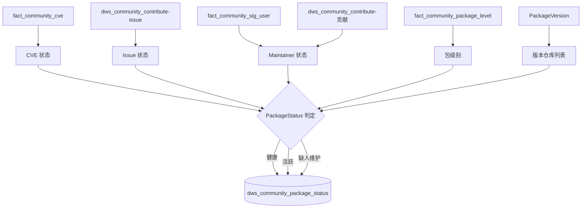
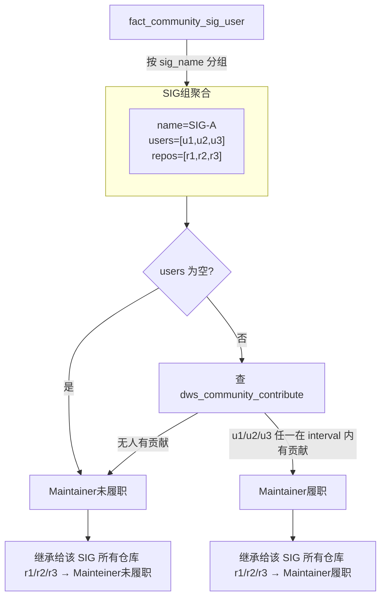

# 软件包状态分析文档

## 指标定义

软件包状态综合 CVE 修复情况、Issue 解决情况和 Maintainer 履职三个维度，将每个软件包归类为"健康"、"活跃"或"缺人维护"。

## 数据采集



## 字段血缘

### 1. CVE 状态 (get_cve_status)

```sql
SELECT repo_path, cve_level, state, customize_state
FROM fact_{community}_cve
WHERE repo_path = %s;
-- state = 'closed'/'rejected' 或 customize_state = '已挂起' → CVE已修复
```
全部 CVE 均为已修复 → `CVE_FIXED`，否则 `CVE_UNFIXED`

### 2. Issue 状态 (get_repo_issue_status)

```sql
SELECT repo_path, count(1)
FROM dws_{community}_contribute
WHERE contrib_type = 'issue'
  AND state NOT IN ('closed', 'rejected')
  AND namespace = %s
  AND is_removed IS NULL
GROUP BY repo_path;
-- 存在 count > 0 的行 → ISSUE_UNFIXED，否则 → ISSUE_FIXED
```

### 3. Maintainer 状态 (get_repo_maintainer_status → compute_sig_maintenance)
**逻辑链路**：
1. 从 `fact_{community}_sig_user` 按 SIG 组聚合，获取每个 SIG 的维护者列表和所辖仓库列表
2. 对每个 SIG，判断其维护者集合中是否有**任意一人**在 `interval` 内（配置项 `maintenance_interval`，如 `'6个月'`）在 `dws_{community}_contribute` 中有过贡献
3. 该 SIG 的判定结果**继承给其所有仓库**：同一个 SIG 下所有仓库的 Maintainer 状态一致

**关键规则**：
- 有维护者（users 非空）→ 任一人在 interval 内有贡献 → `Maintainer履职`，否则 → `Maintainer未履职`
- **维护者为空** → 直接判为 `Maintainer未履职`
- 判断依据是 `dws_contribute` 表的整体贡献记录（含 PR、Issue 等），并非只检查 Issue 回复



```sql
-- 第一步：按 SIG 聚合维护者和仓库
SELECT sig_name,
       array_agg(DISTINCT user_login) AS maintainers,
       array_agg(DISTINCT repo_path)  AS repos
FROM fact_{community}_sig_user
WHERE is_removed IS NULL
GROUP BY sig_name;

-- 第二步：判断每个 SIG 的履职情况
SELECT count(1)
FROM dws_{community}_contribute
WHERE user_login = ANY(%s)      -- SIG 的维护者列表
  AND %s = ANY(sig_name)        -- 当前 SIG 名
  AND is_removed IS NULL
  AND created_at >= CURRENT_DATE - INTERVAL '{interval}';
-- count > 0 → MAINTAINER_ACTIVE，否则 → MAINTAINER_INACTIVE
```

```sql
SELECT count(1)
FROM dws_{community}_contribute
WHERE user_login = ANY(%s)
  AND %s = ANY(sig_name)     -- 当前SIG
  AND is_removed IS NULL
  AND created_at >= CURRENT_DATE - INTERVAL '{interval}';
-- count > 0 → MAINTAINER_ACTIVE，否则 → MAINTAINER_INACTIVE
```

该 SIG 的所有仓库继承同一个 Maintainer 状态。

### 4. 综合判定 (compute_repo_maintenance)

| CVE | Issue | Maintainer | 最终状态 |
|-----|-------|------------|---------|
| CVE已修复 | Issue已解决 | 任意 | **健康** |
| CVE已修复 | Issue未解决 | Mainteiner履职 | **活跃** |
| 其他组合 | | | **缺人维护** |

### 5. 包级别 (get_repo_level)

| kind | level |
|------|-------|
| baseos，在 fact_package_level 中有记录 | 表中的 level 值 |
| baseos，不在表中 | L3 |
| everything-exclude-baseos | L4 |
| 其他 | 等于 kind 值 |

## 相关文件

| 文件 | 说明 |
|------|------|
| `om/dws/package_status.py` | PackageStatus 主逻辑 |
| `om/tasks/package_status_task.py` | 任务入口 |
| `om/config/models.py` | PackageStatusConfig 配置定义 |
| `om/config/constant.py` | 状态常量定义 |
| `om/collector/package_version.py` | 版本仓库信息获取 |

## 输出表

`dws_{community}_package_status`

| 字段 | 来源 |
|------|------|
| uuid | `{version}-{repo_path}-{created_at}` |
| repo_path | 版本仓库列表 |
| version | 发行版版本号 |
| kind | 版本仓库列表 |
| level | get_repo_level |
| cve_status | CVE 状态判定 |
| issue_status | Issue 状态判定 |
| maintainer_status | Maintainer 履职判定 |
| sig_name | 所属 SIG |
| created_at | 计算日期 |
| status | 最终综合状态（健康/活跃/缺人维护） |
